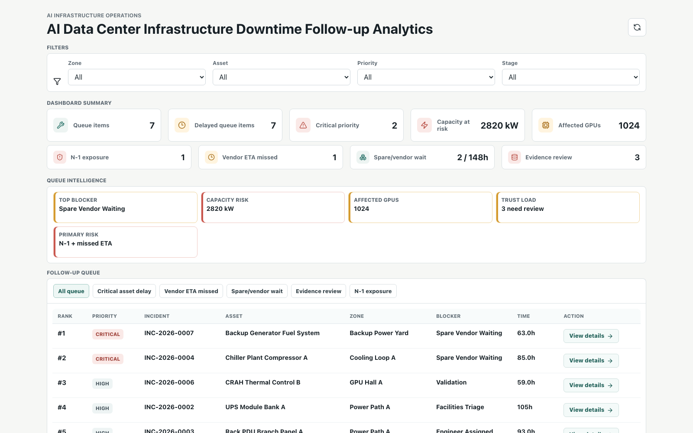
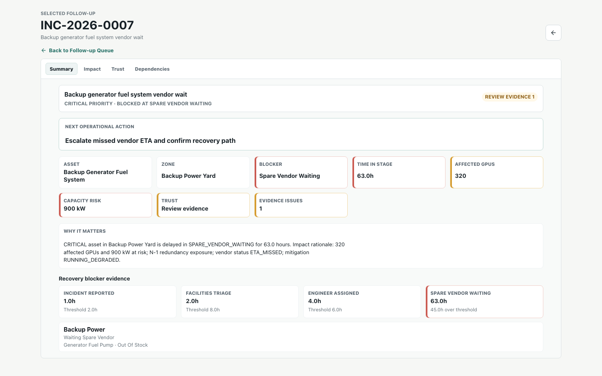

# AI Data Center Infrastructure Downtime Follow-up Analytics

AI Data Center Infrastructure Downtime Follow-up Analytics is an operational analytics product for data center facilities teams.

It answers one practical question:

> Which AI infrastructure incidents are delaying return-to-service, where is the blocker, and what should the team follow up next?





## Why This Exists

AI data center downtime evidence rarely lives in one clean system. Incident records, workflow events, facility work orders, critical spares, vendor waits, validation results, telemetry alerts, impact snapshots, infrastructure assets, and facility zones are often scattered across different operational tools.

That creates a real follow-up problem: teams may know that work is open, but they cannot quickly tell whether GPU capacity risk is blocked by triage, engineer assignment, a spare/vendor wait, repair execution, validation, missed vendor ETA, lost redundancy, or unreliable source data.

This project builds an analytics layer for that problem. It preserves raw source records, normalizes them into a data center infrastructure model, reconstructs state from event history, checks trust issues, and produces a ranked follow-up queue.

## Customer Problem

The fictional customer is an AI infrastructure operations team responsible for GPU data halls. During downtime, facilities supervisors, reliability engineers, capacity operations, and data engineers each see part of the truth:

- incident tickets show priority and current status
- work orders show team ownership and repair state
- spare and vendor notes show external dependencies
- telemetry shows power, cooling, thermal, and sensor evidence
- validation records show whether return-to-service is safe
- impact snapshots show affected racks, GPUs, kW at risk, redundancy, and mitigation

Before this system, the blocked operational decision was:

> Which open infrastructure incident should the operator chase next so GPU capacity can safely return to service?

The follow-up queue is the core product answer. Summaries, selected-row context, and detail pages support the decision, but they are not the main product surface.

## Operating Scenario

The modeled AI data center infrastructure workflow is:

```text
Incident Reported
-> Facilities Triage
-> Engineer Assigned
-> Spare/Vendor Waiting
-> Repair In Progress
-> Validation
-> Restored
```

The workflow labels are not the main value. The value is turning every transition into analytical evidence:

- how long an incident waited
- where delay accumulated
- whether the delay is still actionable
- which asset and zone are affected
- how much rack, GPU, power, thermal, redundancy, and vendor exposure is attached to the incident
- whether the evidence is trustworthy
- what follow-up action is most useful now

## What It Analyzes

- Open infrastructure incidents and delayed incidents
- Current stage and hours in current stage
- Stage lead time compared with threshold hours
- Actionable bottlenecks, excluding terminal restored work from active follow-up surfaces
- Downtime concentration by infrastructure asset and facility zone
- Spare/vendor waiting impact and stock risk
- Capacity-at-risk, affected GPU, redundancy-loss, thermal-breach, vendor ETA, and mitigation context
- Impact confidence status that separates trusted, warning, and unverified impact context
- Repeat failure signals
- Facilities engineer assignment and validation delays
- Latest-run data quality and reconciliation issues
- Ranked downtime follow-up queue with recommended actions

## Architecture

```text
scattered AI infrastructure source records
  -> raw source-preserving tables
  -> core AI infrastructure tables
  -> analytics tables
  -> reconciliation issues
  -> read-only FastAPI endpoints
  -> React dashboard
```

The pipeline computes analytics before API reads. The API is read-only because the product is an operational decision layer, not a replacement for the incident, work order, telemetry, or inventory systems of record.

## Source Integration Model

The simulated sources represent the systems an operator normally has to reconcile manually:

- incident system
- workflow event history
- facility work order system
- critical spare and inventory context
- vendor ETA context
- telemetry alerts and readings
- validation results
- impact snapshots

See `docs/01_architecture.md` for the source-to-question mapping and trust risks.

## Data Layers

- `raw_*`: source-shaped records with source IDs and pipeline run IDs for ingestion traceability
- core tables: `infrastructure_zones`, `infrastructure_assets`, `infrastructure_incidents`, `incident_stage_events`, `facilities_engineers`, `critical_spares`, `facility_work_orders`, `validation_results`, `telemetry_alerts`, and `infrastructure_impact_snapshots`
- analytics tables: current status, stage lead times, follow-up queue with impact score components, bottleneck summary, asset delay summary, zone delay summary, and spare waiting summary
- ops tables: pipeline runs, data quality check results, and reconciliation issues

## Backend Responsibilities

- Generate deterministic AI data center infrastructure sample data
- Load source-shaped raw records with duplicate rejection
- Run raw and core data quality checks
- Reconstruct current incident state from workflow events
- Calculate stage lead time and delay hours
- Build downtime, bottleneck, asset, zone, and spare summaries
- Detect reconciliation issues between core state, event history, and analytics outputs
- Detect impact-context trust issues such as missing snapshots, stale snapshots, vendor ETA mismatch, mitigation evidence gaps, and unexplained thermal or capacity risk
- Model infrastructure topology dependencies across rack, power, cooling, switchgear, generator, CRAH, CDU, and chiller assets
- Score follow-up priority using downtime, criticality, urgency, repeat failure, spare/vendor risk, capacity risk, redundancy risk, thermal risk, vendor ETA risk, and mitigation credit
- Expose read-only analytics, topology, semantic export, and connector-contract endpoints

## Production Story

The practical production path is intentionally modest:

- Dockerized API and frontend build targets
- scheduled pipeline execution against source extracts
- PostgreSQL analytics database
- API health check
- latest-run pipeline status
- data quality and reconciliation report surfaces
- deployment and rollback notes

Kubernetes, Airflow, Kafka, and OpenTelemetry can be added later if they solve a specific operational need. They are deployment and integration choices, not the story. The story is faster, more trusted return-to-service follow-up.

Run backend checks:

```bash
cd backend
.venv/bin/python -m pytest
```

Run the pipeline locally after PostgreSQL is available:

```bash
cd backend
.venv/bin/python -m app.pipeline run --generate-sample --sample-dir generated/sample_data
```

## API Surface

Primary read-only endpoints:

```text
GET /api/overview
GET /api/follow-ups
GET /api/follow-ups/{incident_id}
GET /api/follow-ups/{incident_id}/timeline
GET /api/impact/summary
GET /api/downtime/stages
GET /api/assets/delays
GET /api/zones/delays
GET /api/spares/waiting
GET /api/topology/dependencies
GET /api/semantic/infrastructure.ttl
GET /api/connectors/contracts
GET /api/metadata/filters
GET /api/pipeline-runs
GET /api/data-quality/checks
GET /api/data-quality/checks/{check_result_id}
```

Compatibility routes for the earlier naming are still available for asset, zone, and spare summaries.

## Dashboard

The React dashboard is built for follow-up decisions:

- Read-only KPI and exposure summaries for the currently visible follow-up queue
- Queue Intelligence cards that summarize the visible queue or the selected row
- Queue scope controls for clear queue subsets such as vendor ETA missed, spare/vendor wait, evidence review, and N-1 exposure
- Compact desktop follow-up table with one value per column and explicit `View details` links
- Dedicated follow-up detail route with Summary, Impact, Trust, and Dependencies tabs
- Detail evidence for stage history, work order context, spare context, impact snapshot context, telemetry evidence, vendor/mitigation status, impact trust flags, dependency paths, and quality flags

Run the frontend build:

```bash
cd frontend
npm run build
```

## Tech Stack

- Python
- FastAPI
- SQLAlchemy
- Alembic
- PostgreSQL
- React
- TypeScript
- Vite
- Docker Compose
- pytest

## Reading Path

- `docs/00_project_brief.md`: customer problem, users, success questions, and scope
- `docs/07_workflow_ontology.md`: lifecycle, allowed transitions, exceptions, dependency states, and restoration rules
- `docs/01_architecture.md`: source integration model and layer responsibilities
- `docs/08_analytics_control_layer.md`: state reconstruction, scoring, reconciliation, and trust boundary
- `docs/09_production_rollout.md`: deployment, scheduling, health, observability, data quality reporting, and rollback
- `docs/10_operational_case_study.md`: Problem -> Discovery -> Data sources -> Workflow model -> System design -> Tradeoffs -> Production rollout plan -> Measured impact
- `docs/11_topology_semantic_connectors.md`: phase-two topology graph, RDF/OWL-lite export, and connector contracts
