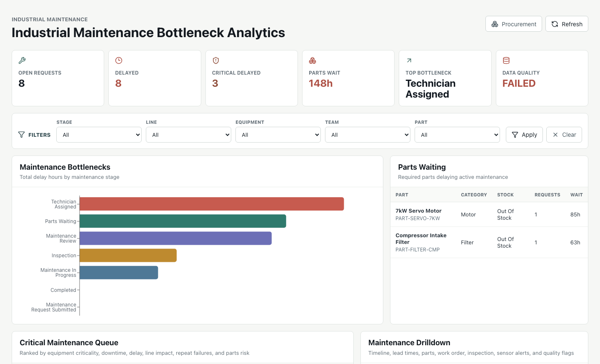
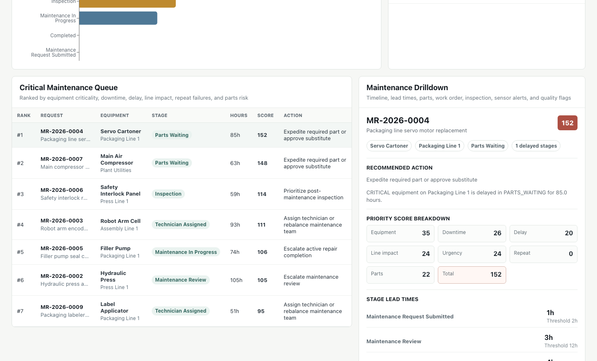

# Industrial Operations Bottleneck Analytics

Project slug: `industrial-operations-bottleneck-analytics`

Operational data system for finding bottlenecks across business and industrial workflows.

The core question:

> Which operational requests are delayed, where is the bottleneck, and what should teams handle next?

Industrial Operations Bottleneck Analytics analyzes workflow event data to identify delayed requests, bottleneck stages, quality issues, and the next recommended operational action.

Implemented domains:

- Procurement bottleneck analytics
- Industrial maintenance bottleneck analytics

## What This Demonstrates

- Event-based business process modeling
- Raw to core to analytics data pipeline design
- PostgreSQL schema design for operational analytics
- Data quality checks and pipeline run observability
- FastAPI read-only analytics APIs
- React dashboard backed by real API data
- Practical decision support: priority queue, bottlenecks, recommended action, and drilldown

## Screenshots

Procurement dashboard:


Procurement request drilldown:


Maintenance dashboard:



Maintenance request drilldown:



## Architecture

```text
Deterministic sample source data
  - procurement requests
  - maintenance requests
        |
        v
Python pipeline
  - raw ingestion
  - raw data quality checks
  - core transformation
  - core data quality checks
  - analytics build
        |
        v
PostgreSQL
  - raw tables
  - core tables
  - analytics tables
  - ops tables
        |
        v
FastAPI read-only analytics APIs
        |
        v
React + Vite dashboard
  - procurement mode
  - maintenance mode
```

## Implemented Features

Procurement analytics:

- Deterministic procurement sample data generator with seeded delay and quality scenarios
- PostgreSQL schema managed by Alembic
- Raw ingestion pipeline with idempotent reruns
- Core transformation into normalized procurement domain tables
- Data quality result logging
- Stage lead time and delay calculations
- Critical request priority scoring with score component breakdowns
- Bottleneck summaries by stage and vendor
- Request detail and timeline API
- Procurement dashboard with overview KPIs, filters, stage bottleneck chart, critical queue, request drilldown, vendor delay table, and data quality status

Industrial maintenance analytics:

- Deterministic maintenance sample scenarios for review delay, technician assignment delay, parts waiting, repair delay, inspection delay, repeat failures, and quality issues
- Maintenance domain models for equipment, production lines, requests, stage events, technicians, parts, work orders, inspections, and sensor alerts
- Raw and core maintenance loading through the existing pipeline
- Maintenance data quality checks recorded in the shared quality results table
- Maintenance current status, stage lead time, bottleneck summaries, critical queue, equipment delay, production line delay, and parts waiting analytics
- Read-only `/api/v2/maintenance` endpoints
- Maintenance dashboard mode with KPIs, bottleneck chart, critical queue, request drilldown, parts waiting, equipment delay, and line delay panels

## Stack

- Backend: Python, FastAPI, SQLAlchemy, Alembic, Pydantic
- Database: PostgreSQL
- Pipeline: Python scripts
- Frontend: React, TypeScript, Vite, Recharts, lucide-react
- Local infra: Docker Compose for PostgreSQL
- Tests: pytest, frontend lint/build

## Project Structure

```text
backend/
  app/
    api/              FastAPI route layer
    models/           SQLAlchemy raw/core/analytics/ops models
    pipeline/         ingestion, quality, transformation, analytics build
    sample_data/      deterministic source data generator
  alembic/            database migrations
  tests/

frontend/
  src/
    api.ts            typed API client
    App.tsx           dashboard shell and interactions

docs/
  00_project_brief.md
  01_architecture.md
  02_data_model.md
  03_pipeline_spec.md
  04_openapi.yaml
  05_ui_spec.md
  06_implementation_plan.md
  07_verification_plan.md
  08_portfolio_package.md
  09_industrial_maintenance_v2_design.md

docker-compose.yml
```

## Local Setup

Prerequisites:

- Docker Desktop
- Python 3.9+
- Node.js and npm

Copy environment values if needed:

```bash
cp .env.example .env
```

Start PostgreSQL:

```bash
docker compose up -d postgres
```

Set up backend:

```bash
cd backend
python3 -m venv .venv
source .venv/bin/activate
python -m pip install --upgrade pip
python -m pip install -r requirements.txt
python -m alembic upgrade head
```

Run the procurement pipeline:

```bash
python -m app.pipeline run --domain procurement --generate-sample --sample-dir generated/sample_data
```

Run the maintenance pipeline:

```bash
python -m app.pipeline run --domain maintenance --generate-sample --sample-dir generated/maintenance_sample_data
```

`PARTIAL_SUCCESS` is expected for the seeded datasets because the sample data intentionally includes quality issues.

Start the backend API:

```bash
uvicorn app.main:app --reload
```

Set up and start the frontend in another terminal:

```bash
cd frontend
npm install
npm run dev
```

Open:

- API health: http://127.0.0.1:8000/api/health
- API docs: http://127.0.0.1:8000/docs
- Dashboard: http://127.0.0.1:5173

The Vite dev server proxies `/api` requests to `http://127.0.0.1:8000`.

## Useful API Endpoints

Procurement:

```text
GET /api/overview
GET /api/bottlenecks/stages
GET /api/bottlenecks/vendors
GET /api/requests/critical
GET /api/requests/{request_id}
GET /api/requests/{request_id}/timeline
GET /api/pipeline-runs
GET /api/data-quality/checks
GET /api/data-quality/checks/{check_result_id}
GET /api/metadata/filters
```

Maintenance:

```text
GET /api/v2/maintenance/overview
GET /api/v2/maintenance/bottlenecks/stages
GET /api/v2/maintenance/requests/critical
GET /api/v2/maintenance/requests/{maintenance_request_id}
GET /api/v2/maintenance/equipment/delays
GET /api/v2/maintenance/lines/delays
GET /api/v2/maintenance/parts/waiting
GET /api/v2/maintenance/metadata/filters
```

Examples:

```bash
curl http://127.0.0.1:8000/api/requests/REQ-0005
curl http://127.0.0.1:8000/api/v2/maintenance/requests/MREQ-0004
```

Filter examples:

```bash
curl 'http://127.0.0.1:8000/api/requests/critical?stage=BUDGET_REVIEW'
curl 'http://127.0.0.1:8000/api/bottlenecks/stages?department_id=DEPT-SAFETY&criticality_level=HIGH'
curl 'http://127.0.0.1:8000/api/v2/maintenance/requests/critical?stage=PARTS_WAITING'
curl 'http://127.0.0.1:8000/api/v2/maintenance/parts/waiting?part_category=MOTOR'
```

## Verification

Backend:

```bash
cd backend
source .venv/bin/activate
python -m compileall -q app tests
python -m pytest
```

Frontend:

```bash
cd frontend
npm run lint
npm run build
```

End-to-end smoke path:

```bash
docker compose up -d postgres
cd backend
source .venv/bin/activate
python -m alembic upgrade head
python -m app.pipeline run --domain procurement --generate-sample --sample-dir generated/sample_data
python -m app.pipeline run --domain maintenance --generate-sample --sample-dir generated/maintenance_sample_data
uvicorn app.main:app --reload
```

Then run the frontend:

```bash
cd frontend
npm run dev
```

Verify in the browser:

- Procurement dashboard KPIs load.
- Procurement filters can narrow the operational queue by stage, department, vendor, criticality, and item category.
- Procurement critical queue includes `PR-2026-0005`.
- Maintenance dashboard mode loads.
- Maintenance critical queue includes `MR-2026-0004`.
- Maintenance parts waiting panel shows `7kW Servo Motor` and `Compressor Intake Filter`.
- Maintenance request drilldown opens with timeline, lead times, work orders, parts, inspection, sensor alerts, and quality flags.
