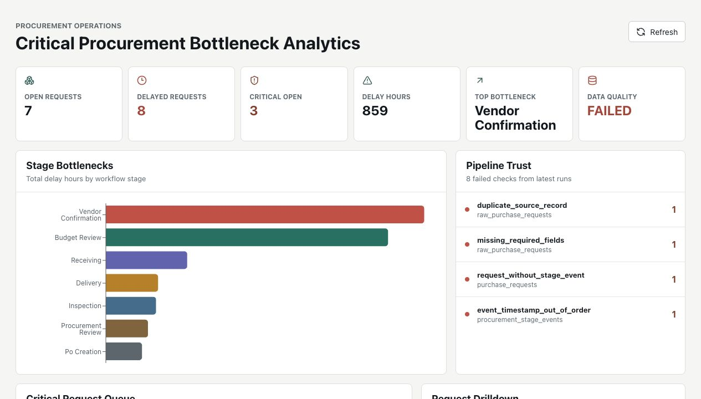
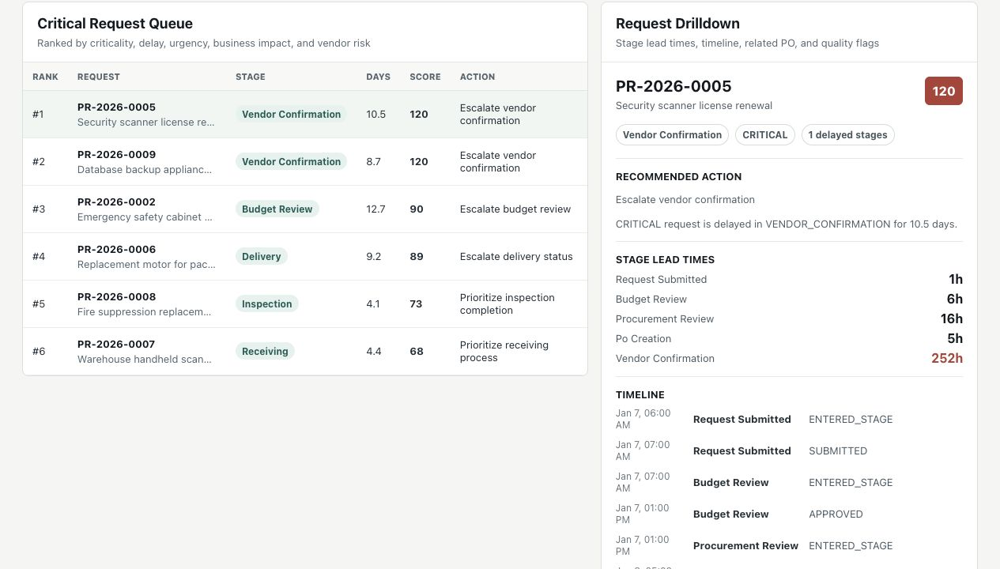

# Critical Procurement Bottleneck Analytics

Operational data system for finding bottlenecks in critical procurement workflows.

The core question:

> Which procurement requests are blocking important work, where are they delayed, and what should operations teams handle first?

This is not a purchase approval CRUD app. It assumes purchase request, purchase order, receipt, and workflow event data already exists, then turns that data into an operational decision layer.

## What This Demonstrates

- Event-based business process modeling
- Raw to core to analytics data pipeline design
- PostgreSQL schema design for operational analytics
- Data quality checks and pipeline run observability
- FastAPI read-only analytics API
- React dashboard backed by real API data
- Practical decision support: priority queue, bottlenecks, recommended action, and drilldown

## Screenshots

Dashboard overview:



Request drilldown:



## Architecture

```text
Deterministic sample procurement source data
        |
        v
Python pipeline
  - raw ingestion
  - raw data quality checks
  - core transformation
  - core data quality checks
  - analytics build
        |
        v
PostgreSQL
  - raw tables
  - core tables
  - analytics tables
  - ops tables
        |
        v
FastAPI read-only analytics API
        |
        v
React + Vite dashboard
```

## Implemented Features

- Deterministic sample data generator with seeded delay and quality scenarios
- PostgreSQL schema managed by Alembic
- Raw ingestion pipeline with idempotent reruns
- Core transformation into normalized procurement domain tables
- Data quality result logging
- Stage lead time and delay calculations
- Critical request priority scoring
- Bottleneck summaries by stage and vendor
- Request detail and timeline API
- Real-data dashboard with:
  - overview KPIs
  - stage bottleneck chart
  - critical request queue
  - request drilldown panel
  - vendor delay table
  - data quality status

## Stack

- Backend: Python, FastAPI, SQLAlchemy, Alembic, Pydantic
- Database: PostgreSQL
- Pipeline: Python scripts
- Frontend: React, TypeScript, Vite, Recharts, lucide-react
- Local infra: Docker Compose for PostgreSQL
- Tests: pytest, frontend lint/build

## Project Structure

```text
backend/
  app/
    api/              FastAPI route layer
    models/           SQLAlchemy raw/core/analytics/ops models
    pipeline/         ingestion, quality, transformation, analytics build
    sample_data/      deterministic source data generator
  alembic/            database migrations
  tests/

frontend/
  src/
    api.ts            typed API client
    App.tsx           dashboard shell and interactions

docs/
  00_project_brief.md
  01_architecture.md
  02_data_model.md
  03_pipeline_spec.md
  04_openapi.yaml
  05_ui_spec.md
  06_implementation_plan.md
  07_verification_plan.md

docker-compose.yml
```

## Local Setup

Prerequisites:

- Docker Desktop
- Python 3.9+
- Node.js and npm

Copy environment values if needed:

```bash
cp .env.example .env
```

Start PostgreSQL:

```bash
docker compose up -d postgres
```

Set up backend:

```bash
cd backend
python3 -m venv .venv
source .venv/bin/activate
python -m pip install --upgrade pip
python -m pip install -r requirements.txt
python -m alembic upgrade head
```

Generate data and run the full pipeline:

```bash
python -m app.pipeline run --generate-sample --sample-dir generated/sample_data
```

Expected result for the seeded dataset:

```text
status=PARTIAL_SUCCESS
rows_extracted=150
failed_checks=4
analytics_records_loaded=244
```

`PARTIAL_SUCCESS` is expected because the sample data intentionally includes quality issues.

Start the backend API:

```bash
uvicorn app.main:app --reload
```

Set up and start the frontend in another terminal:

```bash
cd frontend
npm install
npm run dev
```

Open:

- API health: http://127.0.0.1:8000/api/health
- API docs: http://127.0.0.1:8000/docs
- Dashboard: http://127.0.0.1:5173

The Vite dev server proxies `/api` requests to `http://127.0.0.1:8000`.

## Useful API Endpoints

```text
GET /api/overview
GET /api/bottlenecks/stages
GET /api/bottlenecks/vendors
GET /api/requests/critical
GET /api/requests/{request_id}
GET /api/requests/{request_id}/timeline
GET /api/pipeline-runs
GET /api/data-quality/checks
GET /api/metadata/filters
```

Example:

```bash
curl http://127.0.0.1:8000/api/requests/REQ-0005
```

## Verification

Backend:

```bash
cd backend
source .venv/bin/activate
python -m compileall -q app tests
python -m pytest
```

Frontend:

```bash
cd frontend
npm run lint
npm run build
```

End-to-end smoke path:

```bash
docker compose up -d postgres
cd backend
source .venv/bin/activate
python -m alembic upgrade head
python -m app.pipeline run --generate-sample --sample-dir generated/sample_data
uvicorn app.main:app --reload
```

Then run the frontend:

```bash
cd frontend
npm run dev
```

Verify in the browser:

- Overview KPIs load.
- Top bottleneck is `Vendor Confirmation`.
- Critical queue includes `PR-2026-0005`.
- Clicking a queue row updates Request Drilldown.
- Data quality status shows expected seeded failures.

## Seeded Scenarios

The generated dataset includes:

- normal completed request
- budget review delay
- procurement review correction
- PO creation delay
- vendor confirmation delay
- delivery delay
- receiving delay
- inspection delay
- critical request delayed
- duplicate source record
- missing required fields
- request without stage event
- event timestamp out of order

## V1 Exclusions

Intentionally not included in v1:

- purchase request creation or approval commands
- real ERP integration
- supplier portal
- invoice or payment processing
- authentication and authorization
- streaming infrastructure
- Kubernetes
- AI, LLM, or ML prediction

## Current Portfolio Status

The project now has a working backend pipeline, API, and real-data frontend dashboard. The next improvements would be:

- add department bottleneck endpoint and dashboard section
- add cleaner frontend routing for separate screens
- add automated browser smoke tests
- add deployment notes or a short demo video
